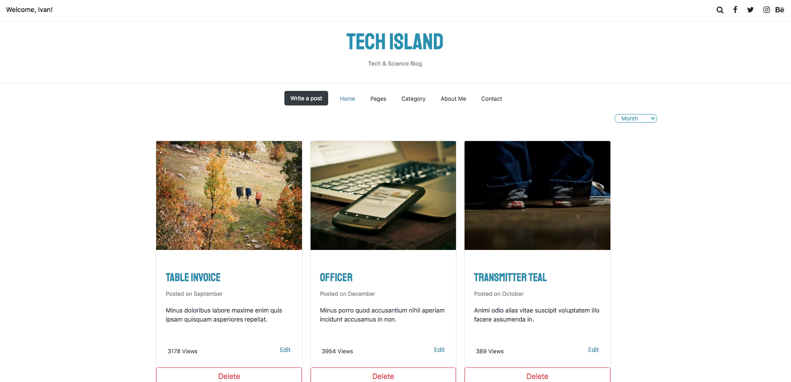

# Ember CRUD Blog

A simple blog project built with EmberJS that allows you to perform all the CRUD (Create, Read, Update & Delete ) operations.

## Table of Contents

* [Features](#features)
* [Endpoints](#endpoints)
* [Prerequisites](#prerequisites)
* [Installation](#installation)
* [Running](#running)
* [Built With](#built-with)
* [Contributing](#contributing)
* [Acknowledgments](#acknowledgments)
* [Authors](#author)
* [License](#license)

## Features

A user can:

<ul>
  <li>See a full list of posts</li>
  <li>Create a new Post.</li>
  <li>Edit a Post</li>
  <li>Delete a Post</li>
</ul>

A Post has:

<ul>
  <li>A random generated image</li>
  <li>Title</li>
  <li>Description</li>
  <li>Number of views</li>
  <li>Date of creation</li>
  <li>Random generated comments</li>
</ul>

Associations:

<ul>
  <li>A post has many comments</li>
  <li>Comments belong to a post</li>
</ul>

## Endpoints

- GET localhost:4200 - Index that displays a list of 10 posts from the beginning.
- GET localhost:4200/posts/id - Displays a single post.
- POST localhost:4200 /posts/new - For creating a new post.
- PATCH localhost:4200 /posts/id/edit - For editing an existing post.

## Prerequisites

You will need the following things properly installed on your computer.

* [Git](https://git-scm.com/)
* [Node.js](https://nodejs.org/) (with npm)
* [Ember CLI](https://ember-cli.com/)
* [Google Chrome](https://google.com/chrome/)

## Installation

Clone this repository by typing the following command inside your terminal:
* `git clone git@github.com:dansantander/emberposts.git` this repository

CD into the folder created by the cloning:
* `cd emberposts`

Install the required dependencies for this project:
* `npm install`

## Running

* `ember serve` or `ember s`
* Visit app at [http://localhost:4200](http://localhost:4200).
* Visit tests at [http://localhost:4200/tests](http://localhost:4200/tests).

## Built With

- Ember JS  
- Git, Github and VScode  

## Contributing

Contributions, issues and feature requests are welcome!

You can do it on [issues page](issues/).

## Acknowledgments

Special thanks to Tech Island for this oportunity.

## Show your support

Give a ⭐️ if you like this project!

## Authors

👤 **Daniel Santander**

- Github: [@dansantander](https://github.com/dansantander)
- Linkedin: [Daniel Santander](https://www.linkedin.com/in/daniel-santander)
- Twitter: [@dansantandr](https://twitter.com/dansantandr)

## License

<strong>Creative Commons 2020</strong>
